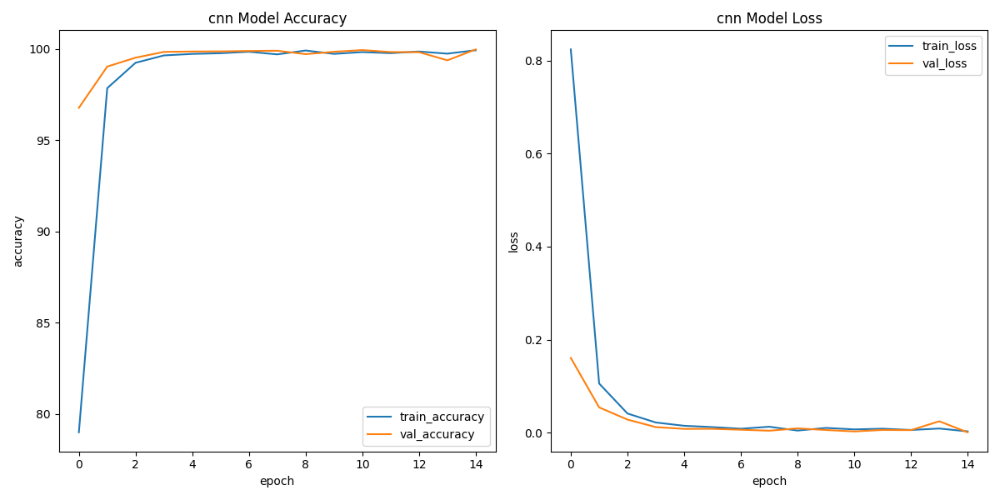
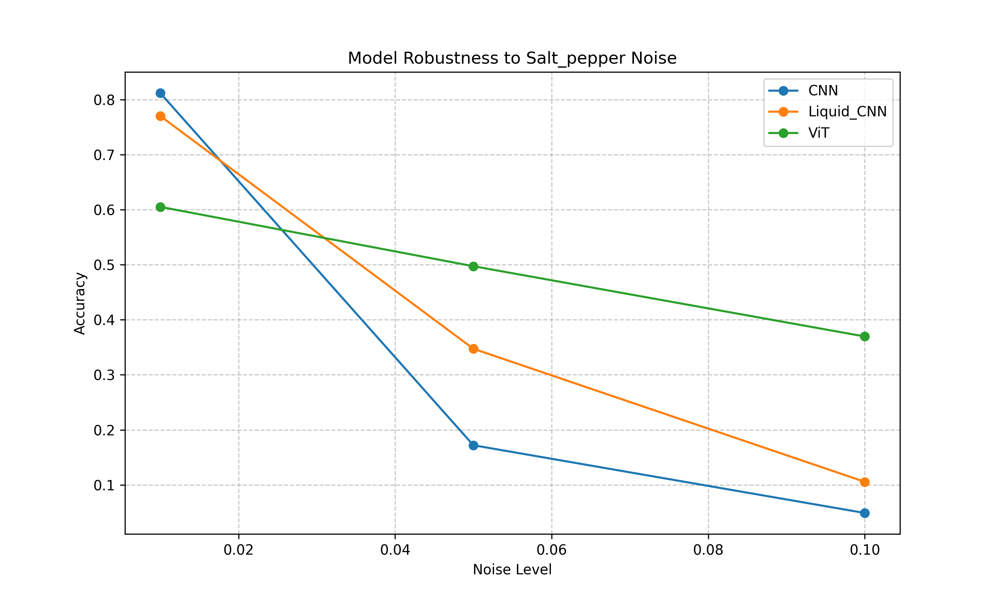
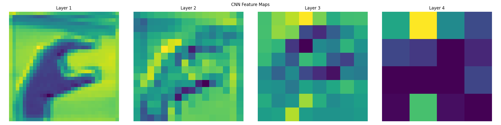
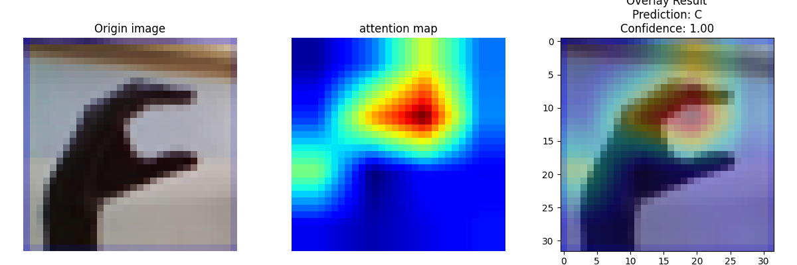

# DynamicHandSign: ASL Recognition with Neural ODEs

This project implements American Sign Language (ASL) recognition using deep learning and PyTorch. It provides three neural network architectures:

- Standard Convolutional Neural Network (CNN)
- Liquid Neural Network based on Neural Ordinary Differential Equations (ODEs)
- Vision Transformer (ViT)

## Features
- High accuracy ASL recognition from images
- Three model architectures: CNN, Liquid CNN, ViT
- Model performance visualization tools
- All models can achieve an accuracy of over 99% on the ASL dataset with appropriate training


## Dataset Preparation
This project uses an American Sign Language (ASL) Alphabet image dataset. Each image is a hand sign corresponding to a specific letter.

1. Download the dataset: [ASL Alphabet Dataset on Kaggle ](https://www.kaggle.com/datasets/grassknoted/asl-alphabet)
2. Create a folder named `dataset/` in the root directory
```bash
mkdir dataset
```
3. Place data folders `asl_alphabet_train/` and `asl_alphabet_test/` inside the `dataset` folder you just created

## Dependencies

`matplotlib`>=3.7.0
`opencv_python`>=4.5.0
`scikit_learn`>=1.0.0
`torch`>=2.0.0
`torchdyn`>=0.9.0
`torchvision`>=0.15.0

## Project Structure
```
ASL-Recognition
├─ dataset/
├─ main.py
├─ output/
├─ README.md
├─ requirements.txt
├─ tools/
│  └─ gpu_test.py
├─ scripts/
│  ├─ noise_test.py
│  ├─ visualize_attention.py
│  └─ visualize_cnn.py
└─ src
   ├─ config.py
   ├─ evaluate.py
   ├─ train.py
   ├─ models
   │  ├─ cnn_model.py
   │  ├─ liquid_cnn_model.py
   │  ├─ vit_model.py
   │  └─ __init__.py
   └─ utils
      ├─ data_processing.py
      ├─ device_utils.py
      └─ visualize.py
```
## Model Architectures

#### CNN Model
A standard Convolutional Neural Network with the following architecture:

- 3 convolutional layers (64, 128, 256 filters)
- Max-pooling and batch normalization after each convolutional layer
- Dropout layers for regularization
- Fully connected layers for classification

#### Liquid CNN Model
An innovative architecture based on Neural ODEs:

- CNN feature extraction front-end (similar to standard CNN)
- Dynamic layer based on Neural ODE
- Linear classification head

#### Vision Transformer (ViT) Model
Transformer-based architecture for image classification:

- Splits images into fixed-size patches (4x4 default)
- 6 attention heads with 384 embedding dimensions
- 6 layers with LayerNorm and MLP blocks
- Linear layer for final predictions


## Usage
```Python
# Train using the standard CNN model (default)
python main.py

# Train using the Liquid Neural Network
python main.py --model liquid

# Train using the ViT model
python main.py --model vit

# Force using CPU even if GPU is available
python main.py --cpu-only

# Visualize sample images before training
python main.py --visualize-samples

# Visualize attention of ViT
python scripts/visualize_attention.py

# Visualize noise robustness
python scripts/noise_test.py
```

## Command Line Arguments

| Argument              | Description                                          | Default |
| --------------------- | -----------------------------------------------------| ------- |
| `--model`             | Choose model architecture (`cnn`, `liquid` or `vit`) | `cnn`   |
| `--cpu-only`          | Force using CPU even if GPU is available             | None    |
| `--visualize-samples` | Visualize sample images before training              | None    |


## Training Process
- Load and preprocess data (resize to 32x32 pixels and normalize)
- Initialize model based on specified architecture
- Train using appropriate optimizer and loss function
- Evaluate model performance on validation set (for standard CNN)
- Visualize training metrics and save model
- Evaluate model accuracy and noise robustness on test set

## Model Outputs
After training, models are saved in the `output/` directory as:

- CNN model: `output/asl_cnn_model.pth`
- Liquid CNN model: `output/asl_liquid_model.pth`
- Vision Transformer: `output/asl_vit_model.pth`

## Visualization
#### Training History Plots
For each model, the system creates dual-panel visualizations showing:


- Output: `output/{model_type}_training_history.png`
- Left Panel: Training and validation accuracy curves over epochs
- Right Panel: Training and validation loss curves over epochs

#### Noise Robustness Evaluation
Assesses the robustness of models against various noise types (Gaussian, salt-and-pepper, and blurred images). This includes:

- Functions to add noise to images.
- An evaluation method to calculate performance metrics (accuracy, precision, recall, F1-score) under different noise scenarios.
- Visualization of noisy samples and comparative performance against noise levels for each model.


#### CNN Feature Maps
Visually represents the activations of different filters at various layers of the network. These maps help analyze how the model interprets input images. 

Example:

- Script: `visualize_cnn.py`
- Output: `output/CNN_feature_maps.png`


#### Vision Transformer Attention Maps
Creates interpretable attention visualizations for ViT models showing.

Example:

- Script: `visualize_attention.py`
- Output: `output/vit_attention_map.png`
